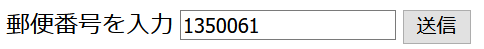
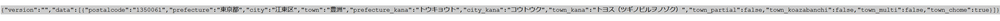

# kenall-js

## ビルド

ttypescriptを用いてビルドする。

node.js のインストールが必要となる。インストール方法については付録参照。

以下のコマンドを実行してビルドする。

```
$ npm install
$ npx ttsc
```

## テスト

jest + ts-jest でテストを行う。

テストを行うには、以下のコマンドを実行する。

```
$ npx jest
```

## サンプルコードの実行


### 事前準備

ケンオールのAPIキーが必要となる。

ケンオールのウェブサイトにログインし、自身のユーザでログインし、APIキーを取得しておくこと。

### 実行手順

`example/test.html` を編集する。

以下のコードを、

```
        var kenallApi = new kenall.KENALL();
```

以下のように書き換える。

```
        var kenallApi = new kenall.KENALL("your_kenall_api_key",{apibase: "https://kenall.jp/v1/api/"} );
```

ここで、 `your_kenall_api_key` は、ケンオールのウェブサイトで取得できるAPIキーである。

javascript が動作する環境で `example/test.html` を開く。

郵便番号入力欄に郵便番号を入力する。



結果がjson形式で返ってくれば成功。




## 付録

### nodenv のインストール

https://github.com/nodenv/nodenv


nodenv を git clone する。

```
git clone https://github.com/nodenv/nodenv.git ~/.nodenv
```

PATHを通す。以下はzshの例。他の方法についてはnodenvページのREADMEを参照のこと。

```
echo 'export PATH="$HOME/.nodenv/bin:$PATH"' >> ~/.zshrc
```

初期化処理を行う。

```
~/.nodenv/bin/nodenv init
```

initの内容を .zshrc (あるいは使っているシェルのrcファイル)に追加する。以下は一例。

```
eval "$(nodenv init -)"
```

node-build をインストールする。

https://github.com/nodenv/node-build

```
# As a nodenv plugin
mkdir -p "$(nodenv root)"/plugins
git clone https://github.com/nodenv/node-build.git "$(nodenv root)"/plugins/node-build
```

## node.jsのインストールと設定

node.js をインストールする。以下は 12.18.3 をインストールする場合の例である。

```
nodenv install 12.18.3
```

node.js を設定する。

```
nodenv global 12.18.3
```

## ライセンス

ASL 2.0

## 著作権表示

2020 株式会社オープンコレクター